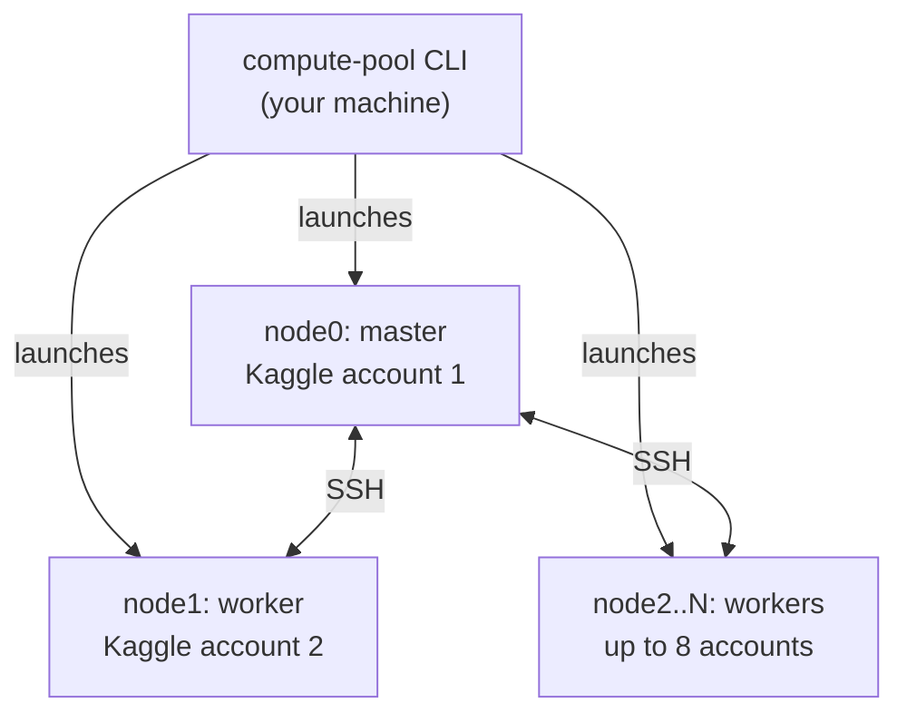
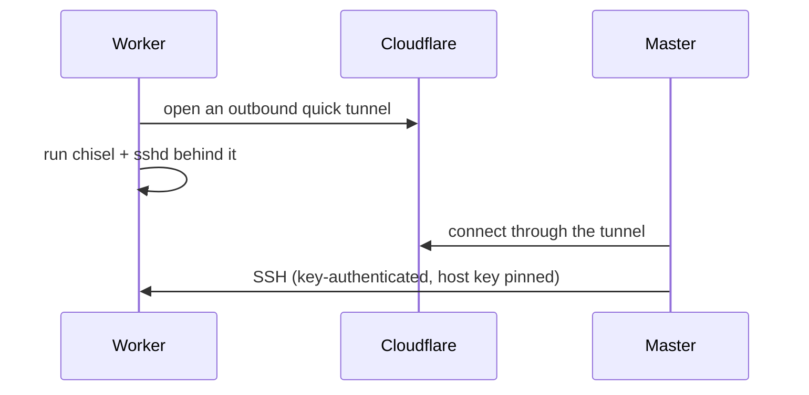
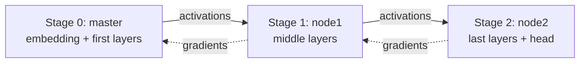

# Compute Pool

Compute Pool turns several Kaggle accounts into one GPU cluster you control from a single CLI. You log in to each account once, and from then on you launch, dispatch work to, and tear down the whole cluster with one command.

It does not give you new GPUs. It pools GPU time you already have (Kaggle's free weekly quota per account), so using several accounts together feels as simple as using one.

Each Kaggle session keeps its own GPUs; this project does not merge them into one CUDA device. What it does is wire the sessions together over SSH and let you choose how work moves across them: independent tasks, data-parallel training, or a model split across nodes. See [Ways to use this infrastructure](#ways-to-use-this-infrastructure).

**Use case.** A group of students on one shared project needs more compute than any one of them has alone. Say there are eight of them: each creates their own Kaggle account, one person per account, exactly as Kaggle expects, and logs in to their own slot with `compute-pool login`. Nobody shares a password, and nobody controls more than one account. The group then runs the project's training job as one cluster built from everyone's own, individually-earned weekly quota.

This project is for educational and personal use.

## Architecture



The CLI starts one Kaggle session per account. The first one is the master; it drives the cluster and holds the SSH keys. Every other node peers in to the master over SSH.

### How nodes reach each other

Kaggle sessions accept no inbound connections, so a worker can't just be reached by address. Each worker opens an outbound tunnel out to the internet, and the master connects back through it.



The master generates the SSH keypair and keeps the private key on its own disk; only the public key ever crosses the wire. Once connected, `ssh node1` (or `node2`, and so on) from the master works exactly like SSH to any other machine.

A health check pings every node every 30 seconds. A node that misses three checks in a row is marked down and drops out of dispatch. It comes back on its own once it answers again, and the master also restarts a dropped tunnel or a dead SSH server automatically.

## Quick start

```bash
compute-pool login --slot 1
compute-pool login --slot 2
compute-pool cluster                   # see which accounts the cluster will use (default: all of them)
compute-pool cluster use 1 3           # or pick specific accounts, e.g. 1 and 3
compute-pool shell --slot cluster      # launch it
```

A cluster needs at least two accounts. Before launching, the CLI checks every account has enough GPU time left; if one doesn't, or a worker fails to come online, the whole cluster stops and tells you which account failed. You won't end up with a half-started cluster you didn't ask for.

### Logging into the web terminal and file manager

Every node's web terminal and file manager are protected by one login:

- **Username:** `compute-pool`, fixed, the same on every node.
- **Password:** there is no default. The first time you run `compute-pool shell`, it stops and asks you to set one. Set or change it any time with `compute-pool pwd`.

The new password takes effect on the *next* `compute-pool shell`. A cluster that's already running keeps the password it started with; restart it to pick up a change. The password is only letters, digits, and `- _ . ! @ # % + =`; quotes, backslashes, and spaces are refused, since it becomes a literal string inside the generated launch script.

Inside the master's terminal, `cluster-status` shows every node:

```bash
$ cluster-status
+----------------------------------------------------------------------+
|                 Compute Pool GPU Cluster Status                      |
+----------------------------------------------------------------------+
[*] node0 (Master): online, 2 GPUs
[*] node1 (Worker): online, 2 GPUs
[*] Online GPUs in cluster: 4
+----------------------------------------------------------------------+
Cluster Tools & Commands:
  - nvidia-smi              -> Local GPU telemetry (master)
  - ssh node1               -> Shell on worker node1 (node<N> for others)
  - crun <command>          -> Run command on every online node
  - crun --gpus '<command>' -> Run one task per online GPU
  - pool-map '<cmd>' --shards N -> Checkpointed shard dispatch (retries, resumable)
  - stop                    -> Terminate cluster session
+----------------------------------------------------------------------+
```

## Ways to use this infrastructure

Pick the pattern that matches how much your workload's parts need to talk to each other. Bring your own training or inference script; Compute Pool's job is to run it correctly across every GPU in the cluster.

### 1. Independent tasks: `crun` / `pool-map`

No GPU needs to talk to another one. Each one just runs its own piece of the work. Start here for sweeps, batch inference, or embedding a dataset.

```bash
# Run one command on every online node:
crun nvidia-smi

# One task per online GPU, across the whole cluster, e.g. a hyperparameter sweep:
crun --gpus "python train.py --lr {task_index}e-4 --dataset {task_index}"
```

Each task gets `CUDA_VISIBLE_DEVICES`, `CP_TASK_INDEX`, `CP_TASK_COUNT`, and `CP_NODE_INDEX` as environment variables. `crun` copies any local file your command needs to every node first.

For a job long enough that a node might drop out partway through, use `pool-map` instead. It retries a failed shard instead of failing the whole job, and checkpoints progress so a rerun with the same job ID picks up where it left off.

```bash
pool-map "python embed.py --shard {task_index}" --shards 100 --job-id embeddings-run1 --output results.json
```

This is the pattern to reach for first. It's the most tested part of the project: no cross-node coordination to get wrong, and it tolerates a node dropping out.

### 2. Data-parallel training: SSH all-reduce

For a model small enough to fit on one GPU, or LoRA adapters on a frozen base model: train a copy on each node and combine gradients with an all-reduce over SSH.

```bash
python3 examples/cluster_comm/allreduce_logreg.py
```

This example checks itself: it compares the distributed result against a single-node run and confirms they match to floating-point precision. Build your own training loop the same way, using `workers/kaggle/wire.py`'s `allreduce_sum_master` / `allreduce_sum_worker`.

### 3. Model-parallel pipeline training: split a model across nodes

For a model too big for one GPU's memory: split it into one stage per node, and run every micro-batch through all the stages in order.



```bash
# On the master, inside the cluster shell:
python3 examples/pipeline_lora/pipeline_master.py
```

`examples/pipeline_lora/` fine-tunes an 8B-parameter Llama model's LoRA adapters this way. It's been run end to end on both two-node and three-node clusters. It includes, all reusable in your own script:

- **Checkpoint and resume**: every stage saves its adapter weights on a schedule and picks up from the last save on restart.
- **Coordinated checkpoints**: the master waits for every stage to save before saving its own, so a crash can never leave two stages at different steps.
- **Automatic reconnect**: if a stage's connection drops mid-run, the master reconnects it, rolls every other stage back to the last checkpoint, and keeps training, instead of ending the run.
- **Dynamic fp16 loss scaling**, owned by one side only, since the scale factor is baked into every gradient downstream of where it's applied.
- **A real learning signal**: held-out evaluation and a smoothed training loss, instead of noisy per-step numbers.
- **Real batching**, with padding and an attention mask built by hand, since the code calls the model's layers directly instead of through its normal padding-aware forward pass.

Configure a run with environment variables (shown here with their defaults):

```bash
STEPS=200 MICROBATCHES=2 MICRO_BATCH_SIZE=4 CKPT_EVERY=25 EVAL_EVERY=25 \
CHECKPOINT_JOB_ID=my-run CHECKPOINT_URI=local:///kaggle/working/checkpoints \
python3 examples/pipeline_lora/pipeline_master.py
```

Rerun with the same `CHECKPOINT_JOB_ID` to resume. `MICROBATCHES` times `MICRO_BATCH_SIZE` is the batch size per optimizer step; raising either uses more GPU memory, so watch `nvidia-smi` if you hit an out-of-memory error.

**On speed:** this works correctly, but it's slow, and that's measured, not guessed. Every micro-batch crosses the network link between nodes, and that link (about 16 MB/s, about 70 ms round trip) is the actual bottleneck, confirmed by watching every GPU sit near 0% utilization during a real training run. The GPUs are mostly waiting on the network, not computing. Splitting a node's own layers across its two local GPUs doesn't help either, since there's nothing local to overlap when the bottleneck isn't local. See the closed issues for the measurements.

### 4. Inference serving

`pool-map` / `crun --gpus` already cover batch inference: shard a list of prompts across every GPU, collect the results. A long-lived, low-latency inference server across the cluster isn't built; `crun --gpus` can still start one server process per GPU, but you'd handle request routing yourself.

### Checking whether your workload fits before you build it

`workers/kaggle/strategy.py` describes what the fabric can actually do (bandwidth, round-trip time, whether direct connections or inbound connections exist) and checks a given communication pattern against it, so a workload that needs more than the link can give fails with a clear reason instead of quietly running slowly.

```python
from workers.kaggle import strategy

strategy.feasible_strategies(strategy.KAGGLE_SSH_FABRIC)
# independent, intra_node_ddp, data_parallel_sync, and pipeline all fit.
# sync_collective (a tight all-reduce every step) does not: it needs direct
# node-to-node connections, which this fabric doesn't have.
```

## Building your own workload on this

You don't need to change Compute Pool itself to run your own code on it:

- **No communication between nodes needed?** Use `crun --gpus` or `pool-map` with your existing script, unchanged. Start here.
- **Need two nodes to exchange data?** Use `workers/kaggle/wire.py` directly. `spawn()` launches your worker script over SSH; `send`/`recv` move any picklable object, including tensors, across the link; `allreduce_sum_master`/`allreduce_sum_worker` give you a ready-made collective. `examples/cluster_comm/allreduce_logreg.py` and `examples/pipeline_lora/` are both built on this and are the reference to copy from.
- **Need your job to survive a node dying?** Use `workers/kaggle/checkpoint.py`'s `open_store(...)`, the same resumable-state primitive every example above uses.
- **Not sure your communication pattern fits?** Check it against `workers/kaggle/strategy.py` first, rather than finding out mid-run.

## Commands

```bash
compute-pool login --slot N          # store a Kaggle account's credentials for slot N
compute-pool pwd                     # set or change the web terminal / file manager password
compute-pool accounts status         # GPU hours remaining per configured account
compute-pool probe --slot N          # quick GPU/driver check on one account
compute-pool cluster [show|use <slots>|reset]  # choose which accounts the cluster uses
compute-pool shell --slot N          # single-account interactive GPU terminal
compute-pool shell --slot cluster    # launch the cluster from the chosen accounts
compute-pool shell-stop [--slot N]   # tear down a session (all, if no slot given)
compute-pool jobs submit --script train.py   # run one script on one account in the background
compute-pool jobs list
```

Run `compute-pool <command> --help` for a command's full options. `torch.cuda.device_count()` reports only the current node's GPUs; that's expected, each node is its own CUDA runtime. Your dispatch choice, `crun`, `pool-map`, or your own script, is what uses every GPU across the cluster.

## Troubleshooting, and asking an AI for help

- Start with the closest example: `examples/cluster_comm/allreduce_logreg.py` for data-parallel work, `examples/pipeline_lora/` for model-parallel, `crun`/`pool-map` for independent tasks.
- A log line like `stage N disconnected; reconnecting it...` means the pipeline recovered on its own; there's nothing to do. A line like `discarded steps ... rerun this script` means it gave up after repeated failed reconnects; rerun the same command with the same job ID to resume.

If you ask an AI assistant for help, give it this first so it starts from the same facts:

```text
You are helping with Compute Pool, a CLI that pools several Kaggle accounts' GPUs into a
cluster. Facts that matter:
- Kaggle's policy is one account per person. Pooling accounts risks a ban. Do not suggest
  ways to hide that multiple accounts are being used.
- Nodes connect over SSH through Cloudflare tunnels, with host keys pinned by the master.
- The link is about 16 MB/s and 70 ms round trip. Pipeline-parallel training is bound by
  that link, not by GPU compute; this is measured, not assumed.
- Check the examples before writing new code: examples/cluster_comm/allreduce_logreg.py
  (data-parallel), examples/pipeline_lora/ (model-parallel, with checkpoints),
  workers/kaggle/ (transport, checkpoints, pool-map).
- torch.distributed's own NCCL or gloo collectives do not work across nodes on this fabric.
Ask for the exact command and the full error before diagnosing, then suggest the smallest change.
```

## What this can and can't do

- **Data parallelism:** yes, checked against a single-node run for correctness.
- **Model parallelism (pipeline):** yes, on two or three nodes so far, with checkpoint, resume, and automatic reconnect.
- **Several GPUs working on one model at once:** yes, across nodes. Within a node, the two local GPUs mostly sit idle regardless of how work is split between them; the bottleneck is the network link between nodes, not local compute.
- **Not supported:** tight collectives across nodes on every step (`torch.distributed` gloo/NCCL), and tensor parallelism across nodes. Both need direct node-to-node connections, which Kaggle doesn't allow.

## How many accounts

The code allows up to 8 account slots. Two things decide how useful more of them are:

- **Independent work** (`crun`, `pool-map`) scales with the number of nodes; this is the path that scales best.
- **Pipeline work** splits across however many nodes are online, but the examples in this repo have only been run on two and three.

Eight is a limit in the code, not a tested maximum. Two- and three-node clusters have been run end to end, including a node failing and recovering automatically. Four or more is untested.

## Known limitations

- **`allreduce_logreg.py` is written for exactly two nodes.** `crun`, `pool-map`, and `pipeline_lora` all scale to however many nodes are online; this one example still hardcodes a single worker.
- **`torch.distributed` (gloo/NCCL) does not work across nodes on this fabric.** It needs direct node-to-node connections, and Kaggle containers accept none. Multi-GPU training within one node via `torch.distributed` is unaffected. Use `workers/kaggle/wire.py` for anything cross-node.
- **Pipeline throughput is bound by the network link, not by GPU compute**, confirmed by measuring GPU utilization directly. Reducing the bytes moved per step would help; splitting compute across more local GPUs would not, and that approach was tried and reverted.
- See the [issue tracker](https://github.com/iam-saiteja/Compute-Pool/issues) for the current list, with evidence from the live cluster behind each one.

## Scope

This isn't a managed GPU cloud, and it doesn't make several machines look like one CUDA device. It's a CLI that starts a fleet of Kaggle sessions, bridges them into one addressable cluster over SSH, and gives you the primitives (checkpointing, a fabric-aware strategy check, a wire transport) to run independent, data-parallel, or model-parallel work across them. Which one to use is your decision, not something the platform forces on you.

## Contributing

See [CONTRIBUTING.md](CONTRIBUTING.md) for setup, what counts as a verified change here, and how to report a bug usefully.

## Project status

Every issue opened during this project's development has been closed, each with real cluster evidence behind it, not just code that looked correct. That includes the hardest one: recovering a multi-node training run after a node's connection drops mid-flight.

What that does and doesn't mean:

- **Independent/map workloads** (`crun`, `pool-map`) are the most tested path here and the one to reach for first.
- **Pipeline-parallel training** works correctly on two and three nodes, with checkpoint, resume, and automatic reconnect all proven on real hardware, but it's slow, and that's an architectural fact about this fabric (see "On speed" above), not a bug waiting to be fixed.
- **Security** improved meaningfully during this project's development (host key pinning, no fixed default password, a cryptographically random session ID), but it has had no outside review. Treat it accordingly.
- **The Kaggle policy risk below is disclosed, not resolved.** Nothing in this project makes pooling accounts compliant with Kaggle's terms.

In short: solid for the workload it's most tested on, functional but slow for pipeline training, and carrying a real platform-policy risk that's yours to decide on, not something this project removes.

## Platform risk: read this before you use real Kaggle accounts

Kaggle's policy, as stated in its own rules and community posts, is one account per person. The use case this project is built for, a team where each member brings their own single account, respects that: nobody here controls more than one account, and nobody shares a login.

What isn't verified is whether Kaggle's terms have anything further to say about several separate account holders deliberately combining their compute for one shared job. That's a different question from the one-account-per-person rule, and this project's research could not confirm an answer either way: it was done by a tool that could not read Kaggle's full terms directly. So the risk isn't zero, it just isn't the same risk as one person running several accounts. Check Kaggle's current terms yourself before relying on this for anything beyond your own team's experimentation, especially if you'd use it outside a small, informal group.

The CLI asks you to accept this risk once, the first time you log in or launch a shell, and records your answer. That acceptance is you making an informed choice; it is not an agreement with Kaggle, and it does not change what Kaggle's terms actually say. The research behind this is in [issue history](https://github.com/iam-saiteja/Compute-Pool/issues?q=is%3Aissue+is%3Aclosed+platform).

**If, instead, one person is behind every account in the pool:** that is the exact pattern Kaggle's one-account-per-person rule describes, not an edge case of it, and every account used that way is individually at risk of a ban.
