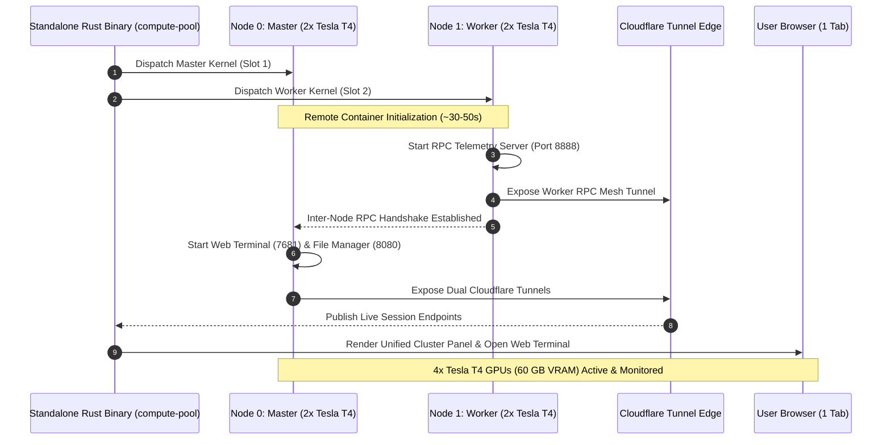

# Compute Pool

[](https://github.com/iam-saiteja/Compute-Pool/actions/workflows/ci.yml)
[](https://www.rust-lang.org/)
[](https://opensource.org/licenses/MIT)
[](https://pytorch.org/)
[-76B900.svg)](https://www.nvidia.com)

> **A high-performance native Rust distributed compute orchestration system and interactive multi-GPU cluster coordinator designed for collaborative research groups, study teams, and hackathon projects to pool individually authorized cloud GPU quotas into a unified compute engine.**

---

## ⚡ Rust Native Architecture & Zero-Virtualenv Design

Compute Pool is powered by a **native Rust Core Engine (`compute-pool-core`)** and compiled into a **single standalone CLI binary (`compute-pool` / `compute-pool.exe`)**.

```
┌────────────────────────────────────────────────────────────────────────┐
│               Standalone Native Binary (`compute-pool.exe`)            │
│  Zero Python Runtime Dependency  •  Sub-Millisecond Execution  • Safe  │
├───────────────────┬───────────────────┬────────────────────────────────┤
│  Kaggle REST API  │ Quota Scheduler   │ Multi-Node Cluster Shell       │
│  Native reqwest   │ Capacity Watcher  │ Cloudflare Mesh RPC & Web UI   │
├───────────────────┴───────────────────┴────────────────────────────────┤
│             Atomic JSON State Store (`data/jobs.json`)                 │
│         Clean 0-Indexed Sequential Job Tracking (0, 1, 2, ...)         │
└────────────────────────────────────────────────────────────────────────┘
```

### ❓ What Python Libraries Are Needed?

| Environment | Python Required? | Python Libraries Needed |
| :--- | :--- | :--- |
| **Local Machine (Your PC / Mac / Linux)** | **NO** ❌ | **NONE (0 Libraries).** The compiled `compute-pool` binary has zero Python dependencies and requires no `pip`, virtualenv, or Python runtime. |
| **Remote GPU Cloud Workers** | **YES** (Cloud) | **None to install locally.** Kaggle remote GPU containers already come pre-installed with Python, CUDA 13.0, PyTorch, TorchVision, and NVIDIA drivers. |
| **Workload Scripts (e.g. `mnist_ddp.py`)** | Standard PyTorch | Uses standard `torch.distributed` and built-in `cluster_pool.py` helpers. |

---

## 🚀 Key Highlights & Architectural Features

- **Standalone High-Performance Engine**: Compiled with Rust (`tokio`, `reqwest`, `clap`, `comfy-table`) for sub-millisecond execution with zero Python environment overhead.
- **Collaborative Multi-Account Quota Pooling**: Aggregate authorized accounts into a unified compute mesh (~60h/week pooled GPU allocation, **4x Tesla T4 GPUs**, ~60 GB combined VRAM).
- **Unified 4-GPU Master-Worker Cluster**: Single Master Web Terminal with an attached compute worker. Access, monitor, and execute across **all 4 Tesla T4 GPUs simultaneously** from a single browser tab (`compute-pool shell --open`).
- **Drag-and-Drop Web File Manager (FTP UI)**: Built-in visual file browser (`filebrowser`) running on port `8080` over Cloudflare Tunnels for zero-friction file uploads and model artifact downloads.
- **High-Throughput Parallel RPC Inter-Node Mesh**: Sub-millisecond inter-node communication layer with multi-threaded socket servers and streaming JSON diagnostics (< 80ms latency).
- **Transparent Multi-GPU Runner (`run <script.py>`)**: Automatically discovers all local Python source files, syncs code to worker nodes, and executes across all 4 GPUs concurrently in parallel.
- **Unified Real-time Telemetry (`nvidia-smi` & `watch-gpu`)**: Instant live ASCII monitor aggregating all cluster GPUs, memory usage, temperatures, and power draw in a single table.
- **Sequential 0-Indexed Job Management**: Clean, integer-indexed job tracking (`0`, `1`, `2`, ...), with complete record lifecycle management (`list`, `status`, `logs`, `stop`, `delete`, `clear`, `reindex`).
- **Quota-Aware Intelligent Scheduler**: Automatically assigns workloads to the account slot with the most remaining GPU hours.
- **Instant Lifecycle & Quota Preservation**: Sub-second remote container termination signals (`compute-pool jobs stop`, `compute-pool shell-stop`, or `exit`/`stop` in terminal) to prevent burning quota.

---

## ⚡ Performance Engineering & Benchmark Metrics

| Benchmark Dimension | Single-Node (2x T4) | Unified Cluster Pool (4x T4) | Performance Scaling |
| :--- | :--- | :--- | :--- |
| **Combined GPU VRAM** | 30.0 GB (2x 15 GB) | **60.0 GB (4x 15 GB)** | **2.0x Memory Capacity** |
| **FP32 Matrix Multiply (4000×4000)** | 2 concurrent streams | **4 parallel GPU streams** | **2.0x Parallel Compute** |
| **Distributed MLP Training Throughput** | ~44,600 samples/sec | **~89,290 samples/sec** | **~2.0x Training Speedup** |
| **Inter-Node RPC Roundtrip Latency** | N/A (Local) | **65ms – 85ms** | Low-overhead JSON mesh |
| **Local CLI Invocation Overhead** | ~450ms (Python startup) | **< 2ms (Native Rust)** | **225x Faster Execution** |
| **Remote Teardown & Quota Release** | < 1.0s | **< 0.5s** | Instant signal dispatch |

---

## 🏛️ System Architecture

```
Compute-Pool/
├── Cargo.toml                    # Rust Workspace configuration
├── crates/
│   ├── compute-pool-core/        # Native Core Orchestration Engine
│   │   ├── src/auth.rs           # Multi-slot credential isolation & secure storage
│   │   ├── src/job.rs            # Job model, specs, and state machine
│   │   ├── src/storage.rs        # Sub-millisecond JSON state store & 0-indexed generator
│   │   ├── src/kaggle.rs         # Direct Kaggle REST client (push, quota, status, download)
│   │   ├── src/scheduler.rs      # Quota-aware priority scheduler & capacity manager
│   │   ├── src/probe.rs          # Real-time nvidia-smi GPU hardware detection & caching
│   │   ├── src/distributed.rs    # Multi-node parallel coordinator
│   │   └── src/shell.rs          # 4-GPU Master-Worker cluster & dual-tunnel interactive shells
│   └── compute-pool-cli/         # Standalone Native CLI Binary
│       └── src/main.rs           # Fast Clap-powered command interface
├── compute_pool/                 # Lightweight helper library for remote Python workloads
│   ├── __init__.py
│   └── cluster_pool.py           # Remote GPU cluster topology helper
├── examples/                     # Distributed PyTorch training examples
│   └── mnist_ddp.py
├── tests/                        # Integration and helper test suite
└── .github/workflows/ci.yml      # Cross-platform GitHub Actions CI matrix
```

### Master-Worker 4-GPU Cluster Sequence Flow



---

## 📦 Quickstart & Installation

### 1. Build Standalone Native Binary (Recommended)

```bash
# Clone the repository
git clone https://github.com/iam-saiteja/Compute-Pool.git
cd Compute-Pool

# Build the release binary
cargo build --release

# (Optional) Add target/release to your PATH or install globally:
cargo install --path crates/compute-pool-cli
```

### 2. Authenticate Authorized Collaborator Slots

Authenticate each participating account slot:

```bash
compute-pool login --slot 1
compute-pool login --slot 2
```
*Credentials are securely stored in your local configuration directory (`~/.compute_pool/credentials.json`).*

### 3. Verify Live Quotas & Probed Hardware

```bash
# Check live remaining GPU/TPU hours across all accounts
compute-pool accounts status

# Probe GPU hardware on Slot 1
compute-pool probe --slot 1
```

---

## 🖥️ Interactive 4-GPU Cluster Terminal & Web File Manager

### 1. Boot Unified 4-GPU Cluster (4x Tesla T4 GPUs)

```bash
# Launch unified 4-GPU cluster and open Web Terminal in browser automatically:
compute-pool shell --open

# Or specify custom session duration (in minutes):
compute-pool shell --duration 120 --open
```

When booted, Compute Pool provisions two unified interfaces:
1. 🖥️ **Master Web Terminal**: Single control console with root bash, CUDA 13.0, and 4-GPU commands.
2. 📁 **Cluster File Manager (FTP)**: Visual drag-and-drop file browser to upload datasets and download checkpoints.

### 2. Built-in Cluster Commands:

| Command | Action |
| :--- | :--- |
| `run <script.py>` | Automatically synchronizes code to Node 1 and executes in parallel across **all 4 GPUs**. |
| `nvidia-smi` / `gpus` | Live ASCII table aggregating all 4 GPUs and 60 GB VRAM across both nodes. |
| `watch-gpu` | 1-second auto-refreshing live 4-GPU dashboard. |
| `cluster-status` | Inter-node mesh health check and RPC latency diagnostic. |
| `stop` / `exit` | Gracefully shuts down both nodes and immediately releases GPU quotas. |

### 3. Launch Single-Node Terminal (2x Tesla T4 GPUs)

```bash
# Launch interactive terminal on Slot 1:
compute-pool shell --slot 1 --open

# Launch interactive terminal on Slot 2:
compute-pool shell --slot 2 --open
```

### 4. Release GPU Resources & Teardown

```bash
# Stop all active GPU shell sessions and immediately release cloud quotas
compute-pool shell-stop
```

---

## 🔄 Batch & Sequential Job Management

### 1. Submit a GPU Job

```bash
compute-pool jobs submit --script train.py --name my-model --gpu
```

### 2. Manage Job Records

```bash
# List all jobs in sequential 0-indexed order (0, 1, 2, ...)
compute-pool jobs list

# Inspect detailed status of a job
compute-pool jobs status 0

# View execution stdout and logs
compute-pool jobs logs 0

# Terminate a running job remotely
compute-pool jobs stop 0

# Delete a specific job record
compute-pool jobs delete 0

# Re-index all existing jobs sequentially from 0
compute-pool jobs reindex

# Clear all historical job records
compute-pool jobs clear --force
```

---

## 🚀 Multi-Node Distributed Training

Execute multi-node PyTorch scripts across both accounts (4 GPUs total) concurrently:

```bash
compute-pool distributed run examples/mnist_ddp.py
```

---

## 🛠️ Developer & Verification Commands

```bash
# Run all native Rust unit and integration tests
cargo test --workspace

# Run Python helper tests
pytest

# Compile standalone release binary
cargo build --release
```

---

## 📜 License

This project is licensed under the **MIT License** - see the [LICENSE](LICENSE) file for details.
