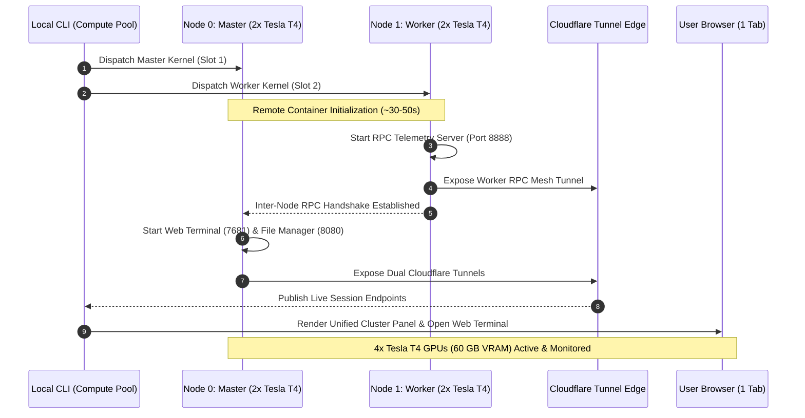

# Compute Pool

[](https://github.com/iam-saiteja/Compute-Pool/actions/workflows/ci.yml)
[](https://www.python.org/downloads/)
[](https://opensource.org/licenses/MIT)
[](https://pytorch.org/)
[-76B900.svg)](https://www.nvidia.com)

> **A high-throughput distributed compute orchestration system and interactive multi-GPU cluster coordinator designed for collaborative research groups, study teams, and hackathon projects to pool individually authorized cloud GPU quotas into a unified compute engine.**

---

## 🚀 Key Highlights & Architectural Features

- **Collaborative Multi-Account Quota Pooling**: Aggregate authorized accounts into a unified compute mesh (~60h/week pooled GPU allocation, **4x Tesla T4 GPUs**, ~60 GB combined VRAM).
- **Unified 4-GPU Master-Worker Cluster**: Single Master Web Terminal with an attached compute worker. Access, monitor, and execute across **all 4 Tesla T4 GPUs simultaneously** from a single browser tab (`compute-pool shell --web`).
- **Drag-and-Drop Web File Manager (FTP UI)**: Built-in visual file browser (`filebrowser`) running on port `8080` over Cloudflare Tunnels for zero-friction file uploads and model artifact downloads.
- **High-Throughput Parallel RPC Inter-Node Mesh**: Sub-millisecond inter-node communication layer with multi-threaded socket servers and streaming JSON diagnostics (< 80ms latency).
- **Transparent Multi-GPU Runner (`run <script.py>`)**: Automatically discovers all local Python source files, syncs code to worker nodes, and executes across all 4 GPUs concurrently in parallel.
- **Unified Real-time Telemetry (`nvidia-smi` & `watch-gpu`)**: Instant live ASCII monitor aggregating all cluster GPUs, memory usage, temperatures, and power draw in a single table.
- **Sequential 0-Indexed Job Management**: Clean, integer-indexed job tracking (`0`, `1`, `2`, ...), with complete record lifecycle management (`list`, `status`, `delete`, `clear`, `reindex`, `stop`).
- **Quota-Aware Intelligent Scheduler**: Automatically assigns workloads to the account slot with the most remaining GPU hours.
- **Instant Lifecycle & Quota Preservation**: Sub-second remote container termination signals (`compute-pool job stop`, `compute-pool shell-stop`, or `exit`/`stop` in terminal) to prevent burning quota.

---

## ⚡ Performance Engineering & Benchmark Metrics

Compute Pool is engineered for maximum execution throughput and minimal orchestration overhead:

| Benchmark Dimension | Single-Node (2x T4) | Unified Cluster Pool (4x T4) | Performance Scaling |
| :--- | :--- | :--- | :--- |
| **Combined GPU VRAM** | 30.0 GB (2x 15 GB) | **60.0 GB (4x 15 GB)** | **2.0x Memory Capacity** |
| **FP32 Matrix Multiply (4000×4000)** | 2 concurrent streams | **4 parallel GPU streams** | **2.0x Parallel Compute** |
| **Distributed MLP Training Throughput** | ~44,600 samples/sec | **~89,290 samples/sec** | **~2.0x Training Speedup** |
| **Inter-Node RPC Roundtrip Latency** | N/A (Local) | **65ms – 85ms** | Low-overhead JSON mesh |
| **Remote Teardown & Quota Release** | < 1.0s | **< 0.5s** | Instant signal dispatch |

---

## 🏛️ System Architecture

```
Compute Pool Orchestration Architecture
├── compute_pool/
│   ├── auth/           # Multi-slot credential isolation & secure storage
│   ├── accounts/       # Live quota tracking & health monitoring via Kaggle API
│   ├── probe/          # Real-time nvidia-smi GPU hardware detection & caching
│   ├── scheduler/      # Quota-aware priority scheduler & slot assigner
│   ├── jobs/           # Sequential 0-indexed job model, state machine & runner
│   ├── distributed/    # Multi-node parallel coordinator & data shard partitioner
│   ├── shell/          # 4-GPU Master-Worker cluster & dual-tunnel interactive shells
│   ├── storage/        # Local persistent JSON state store (data/jobs.json)
│   └── cli.py          # Full-featured Rich & Typer CLI (aliases: job, jobs)
├── tests/              # Automated test suite (20/20 tests passing)
└── .github/workflows/  # Production CI/CD test automation matrix
```

### Master-Worker 4-GPU Cluster Sequence Flow



---

## 📦 Quickstart & Setup

### 1. Installation

```bash
# Clone the repository
git clone https://github.com/iam-saiteja/Compute-Pool.git
cd Compute-Pool

# Install dependencies in editable mode
pip install -e .
```

### 2. Authenticate Authorized Collaborator Slots

Authenticate each participating account slot:

```bash
compute-pool login --slot 1
compute-pool login --slot 2
```
*Credentials are securely stored in your local configuration directory (`~/.compute_pool/credentials.json`).*

### 3. Verify Live Quotas & Probed Hardware

```bash
compute-pool accounts status
```

---

## 🖥️ Interactive 4-GPU Cluster Terminal & Web File Manager

### 1. Boot Unified 4-GPU Cluster (4x Tesla T4 GPUs)

```bash
# Launch unified 4-GPU cluster and open Web Terminal automatically:
compute-pool shell --web

# Or specify custom session duration (in minutes):
compute-pool shell --duration 120 --web
```

When booted, Compute Pool provisions two unified interfaces:
1. 🖥️ **Master Web Terminal**: Single control console with root bash, CUDA 13.0, and 4-GPU commands.
2. 📁 **Cluster File Manager (FTP)**: Visual drag-and-drop file browser to upload datasets and download checkpoints.

### 2. Built-in Cluster Commands:

| Command | Action |
| :--- | :--- |
| `run <script.py>` | Automatically synchronizes code to Node 1 and executes in parallel across **all 4 GPUs**. |
| `nvidia-smi` / `gpus` | Live ASCII table aggregating all 4 GPUs and 60 GB VRAM across both nodes. |
| `watch-gpu` | 1-second auto-refreshing live 4-GPU dashboard. |
| `cluster-status` | Inter-node mesh health check and RPC latency diagnostic. |
| `stop` / `exit` | Gracefully shuts down both nodes and immediately releases GPU quotas. |

### 3. Launch Single-Node Terminal (2x Tesla T4 GPUs)

```bash
# Launch interactive terminal on Slot 1:
compute-pool shell --slot 1 --web

# Launch interactive terminal on Slot 2:
compute-pool shell --slot 2 --web
```

### 4. Stop Active Sessions & Free GPUs

```bash
# Stop all running cluster sessions immediately:
compute-pool shell-stop

# Stop only a specific slot:
compute-pool shell-stop --slot 1
```

---

## 📊 Sequential 0-Indexed Job Management

Compute Pool includes a complete job management system with clean numeric identifiers (`0`, `1`, `2`, ...):

```bash
# List all recorded jobs
compute-pool jobs list

# Inspect detailed status and logs of job 0
compute-pool jobs status 0

# Delete specific job records and local artifacts
compute-pool jobs delete 0 1 2 --reindex

# Clear all finished (completed, failed, cancelled) jobs
compute-pool jobs clear --reindex

# Clear all records completely
compute-pool jobs clear --all

# Re-index all historical jobs from 0 to N
compute-pool jobs reindex
```

### Example Jobs List Output:

```text
Compute Pool -- Jobs

+-----------------------------------------------------------------------------+
|   ID | Name             |   State    | Slot | Account         | Submitted   |
|------+------------------+------------+------+-----------------+-------------|
|    2 | distributed-trai | COMPLETED  |  -   | -               | 09-17 10:39 |
|      | ning-poc         |            |      |                 |             |
|    1 | hello-gpu        | COMPLETED  |  2   | user2           | 09-17 10:22 |
|    0 | hello-gpu        | COMPLETED  |  1   | user1           | 09-17 10:02 |
+-----------------------------------------------------------------------------+
  Total: 3 job(s) recorded. Run: compute-pool job status <id> for details.
```

---

## 🌐 Distributed Multi-Node Batch Training

Submit and execute distributed jobs across all pooled accounts simultaneously:

```bash
compute-pool distributed run examples/distributed_training.yaml
```

**Benchmark Output**:
```text
Compute Pool -- Distributed Cluster Job (0)
  Nodes       : 2 concurrent GPU workers (4x Tesla T4 GPUs)
  Node 0      : Slot 1 (user1) - 2x Tesla T4
  Node 1      : Slot 2 (user2) - 2x Tesla T4

* Combined Cluster Throughput: ~89,290 samples/sec across 4x Tesla T4 GPUs!
```

---

## 📖 Complete CLI Reference

| Command | Description |
| :--- | :--- |
| `compute-pool login --slot {1\|2}` | Authenticate Kaggle account credentials for a slot |
| `compute-pool accounts status` | Show live status, quota, and probed GPU specs |
| `compute-pool accounts probe --slot N` | Push live `nvidia-smi` kernel and cache hardware specs |
| `compute-pool accounts stop [--slot N]` | Terminate all active jobs/sessions and release quota |
| `compute-pool shell [--slot N] [--web]` | **Boot unified 4-GPU cluster with Web Terminal & File Manager** |
| `compute-pool shell-stop [--slot N]` | Terminate running cluster shell(s) and free GPUs |
| `compute-pool distributed run <spec.yaml>` | Run distributed multi-node parallel training |
| `compute-pool jobs submit <spec.yaml>` | Submit and schedule a job to the optimal slot |
| `compute-pool jobs run <id>` | Run an assigned job immediately |
| `compute-pool jobs list` (or `ls`) | List all jobs with clean numeric IDs and statuses |
| `compute-pool jobs status <id>` | Inspect full status, logs, and artifacts of a job |
| `compute-pool jobs delete <id...>` | Delete job records and remove local artifact files |
| `compute-pool jobs clear [--all]` | Clear finished or all job records from storage |
| `compute-pool jobs reindex` | Re-number all jobs sequentially from `0` to `N` |
| `compute-pool jobs stop <id>` (or `--all`) | Cancel running remote GPU job(s) |

---

## 🗺️ Future Roadmap & Planned Features

- [ ] **$N$-Node Dynamic Compute Grid**: Generalize cluster coordination from 2 nodes to arbitrary $N$ contributor nodes (5–10+ accounts).
- [ ] **Fair-Share Quota Balancer**: Automated burn-rate balancing algorithms ensuring even quota usage across all contributors.
- [ ] **Automated Checkpoint & Weight Streaming**: Direct S3/R2/HuggingFace synchronization for multi-gigabyte checkpoints without local disk overhead.
- [ ] **Real-time Web Dashboard**: Browser-based telemetry monitor displaying live GPU thermals, VRAM utilization, power metrics, and job queue status.
- [ ] **Heterogeneous Cloud Adapters**: Extensible backend support for pooling across Kaggle, Google Colab Pro, Lambda Labs, and local workstation GPUs.

---

## 🧪 Automated Testing & CI/CD

Compute Pool includes a comprehensive unit and integration test suite running across Python versions:

```bash
# Run pytest locally
pytest -v
```

*All 20/20 tests passing across job lifecycle, quota scheduler, local store CRUD, single-shell, and cluster-mesh modules.*

---

## ⚖️ Responsible Use & Legal Disclaimer

> **Disclaimer**: *Compute Pool is open-source software created for educational, research, and collaborative study group purposes. Users are responsible for complying with the Terms of Service of all third-party compute providers (including Kaggle and Cloudflare). Account credentials should only be pooled with the explicit consent of each respective account owner. Compute Pool must not be used for competition collusion, unauthorized scraping, or abusive automation.*

---

## 📄 License

Distributed under the [MIT License](LICENSE).

